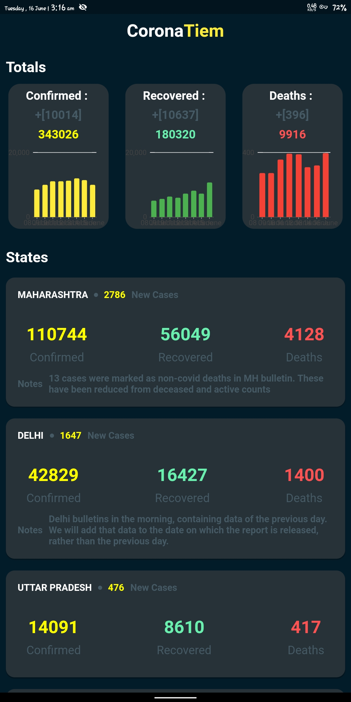

# CoronaTiem   

CoronaTiem is an App for Tracking Corona Virus Cases in India and According to States.The data is provided by https://www.covid19india.org

  - Uses Bloc 
  - Uses Dio  

 #### Feel Free to make a PR or Issue
 
 
 #### Star the Repo if you find it useful 

 

 ##### Peace Out

